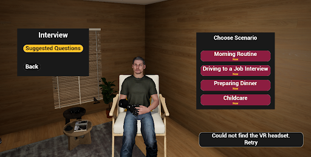
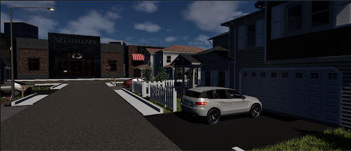
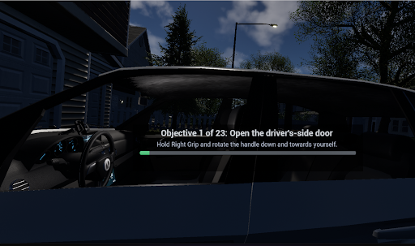
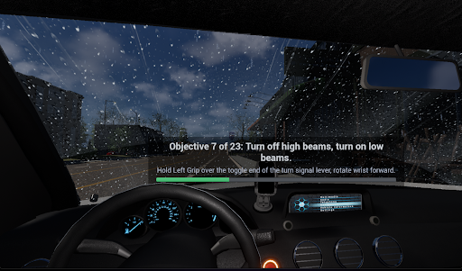
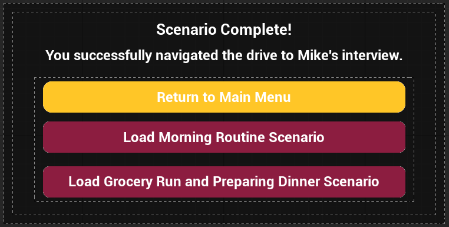
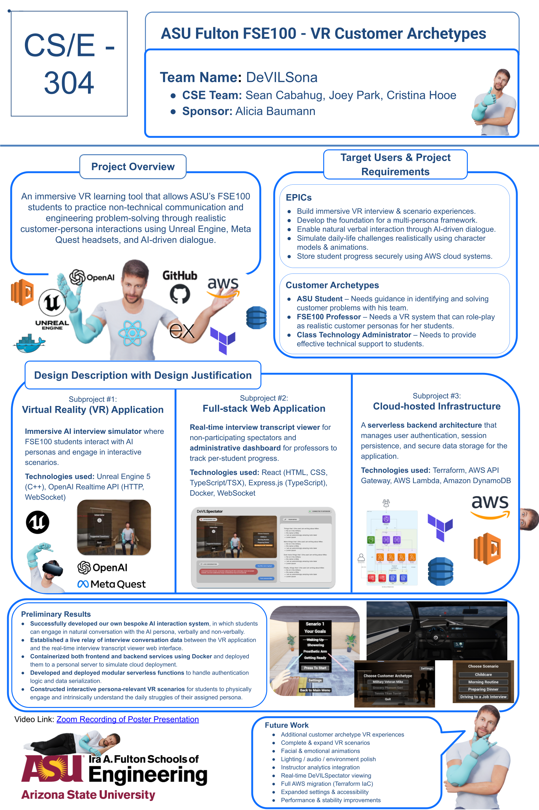
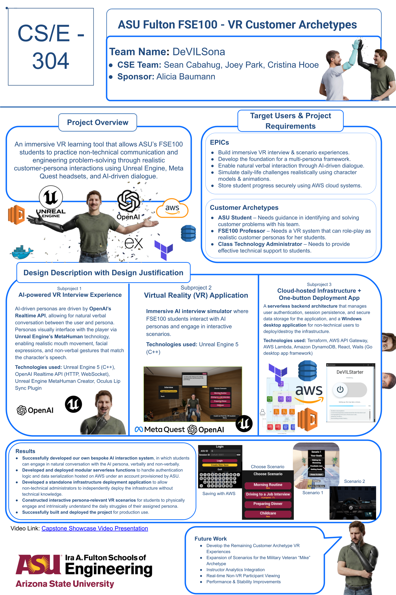

# DeVILSona — VR Customer Archetype Learning Platform

DeVILSona is an immersive virtual reality learning platform developed as an
Arizona State University Computer Science capstone project for the FSE100
DeVILS program.

Built in Unreal Engine 5 and designed for Meta Quest, the system allows
engineering students to speak with an AI-driven customer archetype and
experience interactive scenarios based on that customer's daily life and
challenges.

The project was developed over two semesters from August 2025 through May 2026.

## Project Overview

The FSE100 DeVILS project asks student teams to work with an assigned customer
archetype, interview that customer, and identify a meaningful problem they can
design a solution for.

Traditionally, students receive a written customer profile and interview a
professor or teaching assistant role-playing the customer. DeVILSona was
designed to make that process more immersive and representative of interacting
with the actual archetype by giving students a visually realized,
research-backed customer they could speak with directly and experience within
realistic scenarios.

Rather than relying only on written descriptions or faculty role-play, students
could ask an AI-driven version of the customer questions in real time and
experience challenges drawn from that person's daily life. The goal was to give
students richer context for understanding the customer's needs and help them
identify problems worth solving for their course project.

The original capstone project provided **10 possible customer archetypes** for
development. Our team selected **Military Veteran Mike** as the prototype
archetype and focused on building a complete foundation around his experience.
The resulting system was designed so that future capstone teams could expand
the platform by developing experiences for the remaining archetypes.

Military Veteran Mike is a veteran adjusting to civilian life after losing his
right arm in combat and using a prosthetic limb. His provided archetype
identified challenges involving transportation, meal preparation, grooming,
employment, recreation, home maintenance, physical fitness, and other aspects
of daily life.

The broader DeVILSona platform combined virtual reality, real-time AI dialogue,
MetaHuman animation, interactive scenarios, and cloud-supported infrastructure.

### Interview and Scenario Selection

The main interview environment allows students to speak with Mike and then
transition into interactive scenarios based on his daily-life challenges.

## My Role

**Scenario Design, VR Gameplay Systems, and Character Integration**

My contributions included:

- Created the original Figma prototype that helped establish the experience
  flow and interface structure later implemented in Unreal Engine.
- Conducted research into Military Veteran Mike's needs and experiences and
  designed eight potential interactive scenarios based on his daily-life
  challenges.
- Helped determine how the written customer archetype could be translated into
  interactive experiences that supported the problem-discovery goals of the
  FSE100 project.
- Replaced the earlier character implementation with a MetaHuman version of
  Mike to improve realism and visual quality.
- Integrated Mike's prosthetic arm into the MetaHuman character and resolved
  mesh, clothing, and presentation issues associated with the prosthesis.
- Implemented Oculus Lip Sync and refined facial and body animation behavior
  for spoken AI responses.
- Owned the end-to-end development of **Driving to a Job Interview**, including
  scenario design, world building, asset procurement and integration,
  interaction design, Blueprint gameplay logic, objective flow, HUD systems,
  lighting, audio, Niagara effects, and final integration.
- Modified existing AI systems to support spoken scripted dialogue and persona
  voice switching within the driving scenario.
- Resolved an audio feedback issue by integrating microphone capture behavior
  that prevented the AI from hearing and responding to its own generated
  speech.
- Helped achieve a working standalone Meta Quest APK that retained both
  MetaHuman and lip-sync functionality.
- Contributed to technical and user-facing project documentation covering
  development, deployment, troubleshooting, and scenario implementation.

## Driving to a Job Interview

My largest individual contribution was the full design and implementation of
the **Driving to a Job Interview** scenario.

The scenario places the player in Mike's perspective as he prepares to drive
along a designated route to a job interview. It was based in part on the
transportation and employment challenges identified in Mike's customer
archetype.

The experience guides the player through a sequence of interactive objectives,
including:

- entering the vehicle
- fastening the seatbelt
- starting the vehicle
- shifting between park, reverse, and drive
- operating headlights and high beams
- using windshield wipers
- operating turn signals
- responding to events during the drive
- parking and completing the arrival sequence

The scenario was designed to help students consider accessibility,
independence, transportation, and vehicle-control design from the perspective
of a customer adapting to the use of a prosthetic arm.

Development included the complete scenario environment, vehicle interactions,
Blueprint gameplay logic, objective and progression systems, HUD and
instructional UI, lighting, audio, visual effects, dialogue behavior, and final
integration.

### Scenario Environment

The scenario begins outside Mike's home and transitions from preparation into a
guided drive through the environment.

### Interactive Objective System

The player completes a sequence of guided interactions using VR controls. The
HUD communicates the current objective and provides instructions for each
interaction.

Later objectives combine vehicle controls, environmental conditions, and
instructional feedback while the player is actively driving.

### Scenario Completion

After completing the full sequence of objectives and reaching the interview
destination, the player is presented with a completion screen and options to
return to the main menu or continue to another scenario.

## Character and Dialogue Systems

An important part of the project was making Military Veteran Mike feel like a
specific customer rather than a generic game character.

I led the transition from the project's earlier character implementation to a
custom MetaHuman version of Mike and integrated his prosthetic arm into the
character setup. This required resolving body geometry, clothing, and visual
presentation issues around the prosthesis.

I also implemented Oculus Lip Sync and refined facial and body animation
behavior for AI-driven spoken responses.

Additional modifications to existing project systems allowed scripted,
non-conversational dialogue within the driving scenario to generate spoken
responses and supported switching between different OpenAI persona voices.

## Research and Scenario Design

Before scenario implementation, I conducted research to expand upon the
Military Veteran Mike archetype and better understand the practical challenges
associated with his circumstances.

That research informed the design of **eight potential scenarios** tied to
Mike's daily life. Each scenario was developed around situations in which
students could observe or experience a challenge and use that experience to
identify possible engineering problems worth solving.

Three scenarios were ultimately selected for implementation in the final
prototype:

- **Morning Routine**
- **Driving to a Job Interview**
- **Preparing Dinner**

Morning Routine and Driving to a Job Interview were completed, while Preparing
Dinner remained partially implemented at the end of the capstone.

## Technologies I Worked With

- Unreal Engine 5
- Blueprint Visual Scripting
- MetaHuman
- Meta Quest
- Oculus Lip Sync
- Figma
- Autodesk Maya
- Git
- GitHub

## Broader Team Project

DeVILSona was developed collaboratively by a three-person Computer Science
capstone team.

In addition to the systems described above, the complete project included:

- real-time AI customer interviews
- voice and text interaction
- additional VR scenarios
- AWS-backed session and save infrastructure
- deployment tooling
- a companion spectator web application
- Meta Quest desktop and standalone deployment
- extensive technical and deployment documentation

Responsibilities for these systems were divided among team members. The
sections above describe the areas I personally designed, developed, or
contributed to.

## Prototype for Future Development

DeVILSona was designed as more than a one-time demonstration.

The original capstone proposal identified 10 customer archetypes that could
eventually be represented through immersive experiences. Because developing
all 10 within a single capstone cycle was not realistic, our team focused on
Military Veteran Mike in enough depth to establish a working technical,
interaction, character, and documentation foundation.

The resulting prototype provides a model that future ASU capstone teams can
build upon when developing experiences for the remaining customer archetypes.

## Project Evolution

DeVILSona was developed across two semesters.

### Fall 2025

The first semester focused on defining the project direction, developing the
initial prototype and system architecture, researching Military Veteran Mike,
designing potential scenarios, and establishing the VR, AI, and supporting
systems.

### Spring 2026

The second semester focused on completing the major VR scenarios, improving
character realism and animation, integrating and refining project systems,
testing Meta Quest deployment, and preparing the platform for final delivery
and future development.

## Project Links

- [Original Figma Prototype](https://www.figma.com/proto/Bdi6wjxaKxjFydbq6f0LLl/FSE100-VR-Customer-Archetypes-Updated-Sprint-2?node-id=0-1&t=I8sGDLra2nKcCq5p-1)
- [Official DeVILSona Documentation](https://fse100capstone.github.io/DeVILSona-docs/)
  - [Driving Scenario — Developer Guide](https://fse100capstone.github.io/DeVILSona-docs/developer-guide/driving-scenario-overview/#educator-sponsor-guide)
  - [Driving Scenario — Student/User Guide](https://fse100capstone.github.io/DeVILSona-docs/user-guide/scenario2-drivingtoajobinterview/#developer-knowledge-base)
- [Personal Demo — Interview + Driving Scenario](https://www.youtube.com/watch?v=BZ-0NvRNGX0)
- [ASU Capstone Showcase](https://showcase.asucapstone.com/survey/10552)

The original Figma prototype shows the early interaction flow and interface
concepts I created before the experience was implemented in Unreal Engine.

The official DeVILSona documentation is the complete public documentation site
for the project, covering system architecture, implementation, deployment,
troubleshooting, user guidance, and development details. The two Driving
Scenario links above point directly to pages within that documentation that
cover the scenario I designed and developed.

The personal demo shows me using the final Windows desktop build with a Meta
Quest headset connected through Meta Horizon Link, including an interview with
Military Veteran Mike and a complete playthrough of the **Driving to a Job
Interview** scenario.

The ASU Capstone Showcase page contains the team's official project overview
and showcase video.

## Source Code

The original source repositories were developed as part of a collaborative
university capstone project and are not publicly distributed through this
portfolio repository.

This repository is intended to document the project, demonstrate my individual
contributions, and provide links to publicly available project materials and
technical documentation.

## Team

**DeVILSona — Arizona State University Computer Science Capstone, 2025–2026**

**CSE Team**
- Cristina Hooe
- Sean Cabahug
- Joey Park

**Project Sponsor**
- Alicia Baumann
